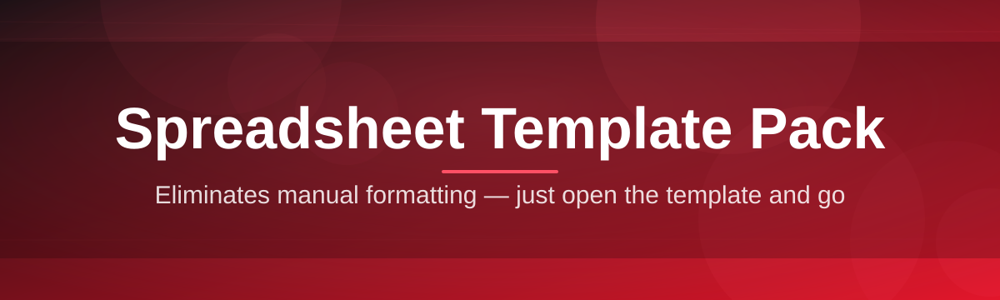
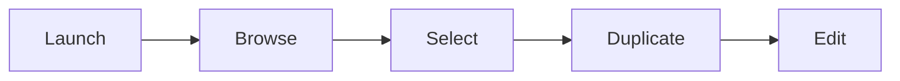

# spreadsheet-template-suite 📊✨

  

*A hand-tuned pack of spreadsheet templates that turns blank grids into finished systems in minutes, not weekends.*

  

---

### 🚀 Quick Start (do this first, read later)

1. Hit the **DOWNLOAD** button below and grab the latest build of the pack.

2. Unzip it anywhere — Desktop, Documents, a thumb drive, doesn't matter.

3. Open the launcher, pick a template category, and start filling in cells.

That's it. Everything else in this README is context, not prerequisite.

---

## 🧭 Overview

`spreadsheet-template-suite` is a curated, obsessively-organized collection of spreadsheet templates covering budgeting, project tracking, inventory management, invoicing, habit tracking, CRM-lite workflows, and a dozen other everyday spreadsheet jobs people reinvent from scratch every single time. This project started as a personal folder of `.xlsx` files I kept copy-pasting between jobs and side projects, and it slowly turned into something I couldn't stop polishing — hence the "suite." Every template here has been used for real work, broken, fixed, and used again.

The philosophy is simple: spreadsheets are one of the most powerful tools ever shipped to regular humans, but the blank-grid-and-a-blinking-cursor problem is real. Nobody wants to design column headers and conditional formatting rules before they can track their own expenses. This pack exists to skip that step entirely — open a template, and you're already working, not architecting.

This is built for freelancers, small business owners, students, hobby project managers, and anyone who has ever thought "there has to be a template for this" and been disappointed by what they found online. No account creation, no cloud lock-in, no subscription — just a launcher, a template library, and your data staying exactly where you put it.

  

> [!TIP]
> Star the repo if this saves you even one Sunday afternoon of building a tracker from scratch. It genuinely helps other people find it.

---

## 🎛️ What's Inside the Pack

- **Budget & Finance Templates** — from bare-bones monthly budgets to multi-account cash flow forecasts with built-in category breakdowns.

- **Project & Task Trackers** — Gantt-style timelines, kanban-flavored status boards, and sprint logs that don't require a subscription to a "real" PM tool.

- **Inventory & Stock Sheets** — reorder-point alerts, SKU tables, and warehouse-lite tracking for small sellers who don't need full ERP software.

- **Invoicing & Client Ledgers** — pre-built tax fields, auto-calculating totals, and a client history tab so you're not rebuilding an invoice every month.

- **Habit & Goal Trackers** — streak counters, weekly review tabs, and visual progress bars powered entirely by conditional formatting.

- **CRM-Lite Contact Sheets** — lightweight relationship tracking for freelancers who need "who did I talk to and when" without a CRM login.

- **Smart Theming Engine** — every template ships in light and dark palettes, and colors cascade automatically when you switch themes in the launcher.

- **One-Click Template Duplication** — spin up a fresh, blank copy of any template without touching your original, ever.

<strong>📦 Full template category breakdown</strong>

| Category | Templates Included | Best For |
|---|---|---|
| Finance | 9 | Freelancers, households |
| Project Management | 7 | Small teams, solo builders |
| Inventory | 5 | Etsy sellers, small retail |
| Invoicing | 4 | Contractors, consultants |
| Personal Productivity | 8 | Habit tracking, journaling |
| CRM-lite | 3 | Sales-adjacent freelance work |

> [!NOTE]
> New templates get added roughly every release cycle. If a category you need isn't here yet, open an issue — genuinely, that's how half of these got made.

---

## 🏁 Getting Started, Properly

1. Visit the landing page via the download button and grab the current release build.

2. Extract the archive to a permanent folder — the launcher writes a small local settings file next to itself, so avoid running it straight from a temp/downloads folder long-term.

3. Launch the app, browse categories in the sidebar, and click any template thumbnail to preview it before committing.

4. Duplicate the template into your working folder and start editing — your original stays untouched as a clean master copy.

> [!IMPORTANT]
> This is a standalone Windows application. It does not require Excel, Google Sheets, or any online account to browse and duplicate templates — actual editing happens in whichever spreadsheet software you already have installed.

---

## 💻 System Requirements

  

- Windows 10 or Windows 11 (64-bit)

- No external dependencies, runtimes, or plugins required

- Roughly 150 MB of disk space for the full template library

- A spreadsheet application capable of opening `.xlsx` files (for editing the generated templates themselves)

---

<strong>⚙️ How It Works — Architecture & Workflow</strong>

The suite is split into two intentionally simple layers: a lightweight launcher shell and a static, versioned template library. The launcher never modifies library files directly — it always works through duplication, which is the single most important design decision in this whole project. Your master templates stay pristine no matter how much you experiment.

1. **Launch** — the app boots and reads the local template index.

2. **Browse** — categories load with thumbnail previews rendered from cached snapshots.

3. **Select** — choosing a template loads its metadata (formulas, formatting, theme variant).

4. **Duplicate** — a fresh copy is written to your chosen working directory.

5. **Edit** — you open the duplicate in your spreadsheet app of choice and make it yours.

> [!NOTE]
> Because duplication happens at the filesystem level rather than through some in-memory export process, the resulting file is a genuine, fully editable `.xlsx` — no hidden macros, no locked cells you didn't ask for.

---

<strong>🛟 Troubleshooting — Real Questions From Real Users</strong>

**Q: My spreadsheet app flags the downloaded template as "protected" or opens it read-only.**
A: That's usually your spreadsheet software's default protected-view for downloaded files, not something the template itself set. Use the "Enable Editing" prompt in your spreadsheet app.

**Q: Conditional formatting colors look different from the preview thumbnail.**
A: Some spreadsheet apps render conditional formatting gradients slightly differently. Try toggling the theme in-app once after opening — this refreshes the formatting cache in most cases.

**Q: The launcher says a template failed to duplicate.**
A: This almost always means the destination folder is read-only or synced through a cloud drive that's mid-sync. Pick a local folder and try again.

**Q: Formulas show `#REF!` after I moved rows around.**
A: This is standard spreadsheet formula behavior, not a template bug — moving referenced rows can break relative references. Duplicate a fresh copy of the template rather than restructuring the original layout.

**Q: Can I use these templates in Google Sheets instead of desktop Excel-style apps?**
A: Yes — the `.xlsx` format duplicates and generates are broadly compatible. Import them and formulas/formatting should carry over cleanly in the vast majority of cases.

**Q: Dark theme templates look washed out when printed.**
A: Printing typically ignores screen theme entirely and defaults to a print-friendly light layout automatically — check your print preview before assuming something's broken.

---

## 🎨 UI, UX & Little Touches

- **Themes** — Light, Dark, and a low-contrast "Paper" mode designed for long editing sessions.

- **Keyboard Shortcuts:**

  | Shortcut | Action |
  |---|---|
  | `Ctrl + F` | Search templates by name |
  | `Ctrl + D` | Duplicate selected template |
  | `Ctrl + T` | Toggle theme |
  | `Esc` | Close preview panel |

- **Settings Panel** — remembers your default duplication folder, preferred theme, and last-used category between sessions.

- **Favorites** — pin frequently used templates to the top of the launcher for faster access.

> [!WARNING]
> Renaming files inside the library folder manually (rather than through the launcher) can break the template index. Use in-app duplication instead of dragging files around in File Explorer.

---

## 🤝 Contributing & Community

This project grew from a personal habit into something other people actually rely on, and that's genuinely humbling. Contributions, template ideas, and bug reports are all welcome:

- Open an issue for template requests, bugs, or formatting inconsistencies.

- Submit a pull request if you've built a template you think belongs in the pack — clean formulas and a short usage note go a long way.

- Discussions are open for workflow tips, template combos, and general spreadsheet-nerd energy.

> [!TIP]
> The best contributions usually come from someone hitting a real gap while doing actual work — if you had to build a workaround, others probably need that fix too.

---

## 📜 License

Released under the [MIT License](LICENSE), 2026. Use it, remix it, ship it inside your own workflows — just keep the license notice intact.

---

## ⚠️ Disclaimer

This suite is provided as-is, built and maintained as a passion project rather than a commercial product. While every template is tested against real-world use cases, always keep independent backups of financial, business, or otherwise critical data. The maintainers are not liable for data loss, formula errors introduced through manual editing, or decisions made based on spreadsheet outputs.

---

  

